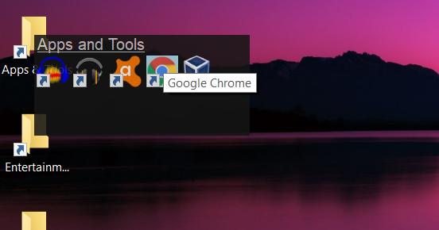

# Pop-Up-Folders

A program to aid in desktop personalization. Create folders that pop-up containing shortcuts and files.

## Downloads
Windows Build: [Windows](https://github.com/Xapier14/Pop-Up-Folders/raw/master/Builds/Pop-Up_Folders-5-23-2020.zip)

## Usage
### Creating a folder
1. Open the Pop-Up Folders application. This will open up the settings window for the app.
1. Drag the icons you want to have in the folder to the gray panel labeled: "Folder Contents:".
1. Enter a 'Call Name'. The call name is the identifier for the folder that you are about to create. It must be unique and should have no spaces.
1. Enter the display name for the folder. This is the actual name displayed when opening the folder. It is also the default name for the folder shortcut unless changed.
1. Click on 'Make Folder' to create the folder shortcut. A save file dialog with open asking where you want to save the shortcut file.
1. The folder is now created and is registered on the application.

### Opening a folder in an explorer window
1. Hover your cursor on a folder shortcut.
1. While holding the shift key, double-click on the shortcut to open it.
1. A window will be opened in the actual directory of the Pop-Up Folder.

**NOTE:** Do not delete "info.ini" in the folder directory. This file is used by the app to store folder information.

### Deleting a folder
1. Hover your cursor on a folder shortcut.
1. While holding both the shift key and the control key, double-click on the shortcut to open it.
1. A dialog will appear asking if you want to delete the pop-up folder. Click on "yes" if you are sure you want to delete the folder.
1. After clicking yes, the folder will be deleted and unregistered from the application. Delete the folder shortcut to finish deleting the folder.
